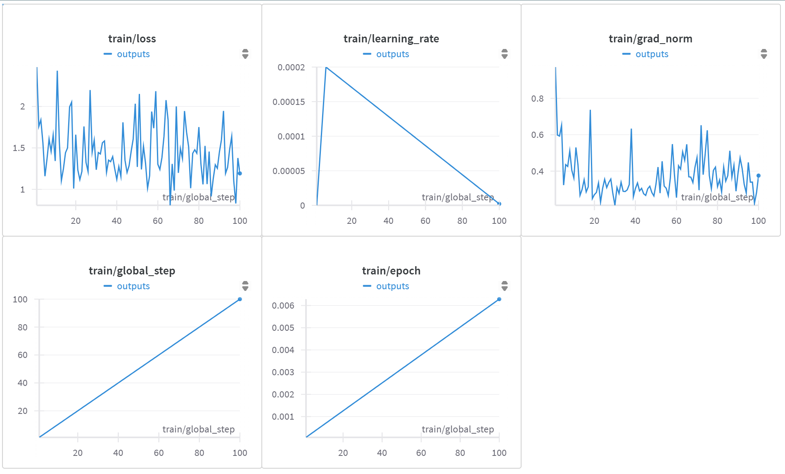
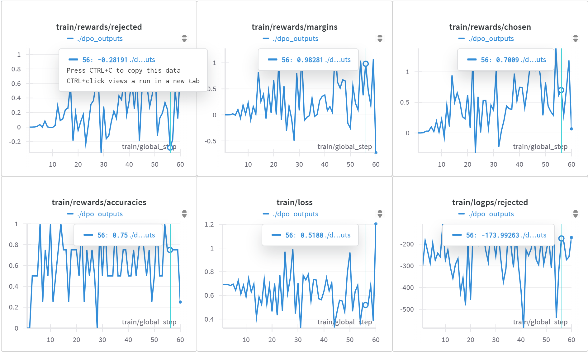
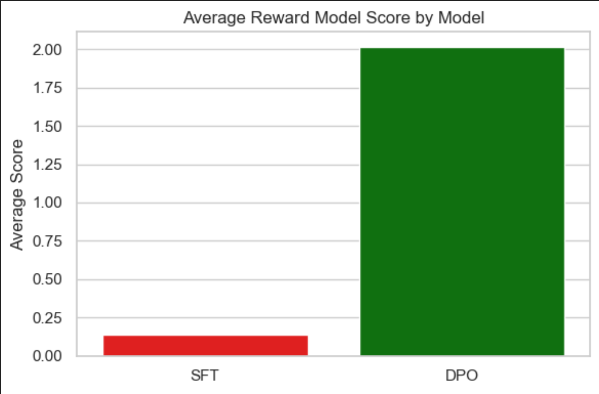
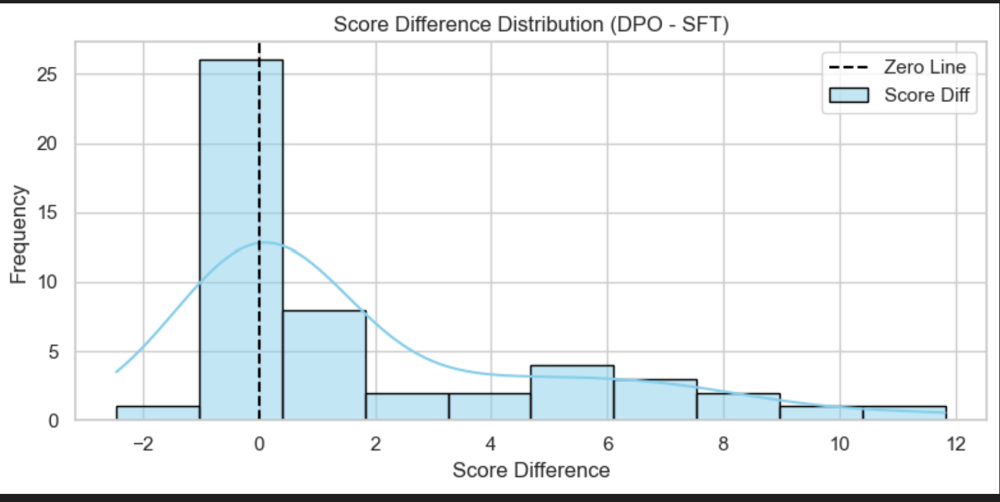
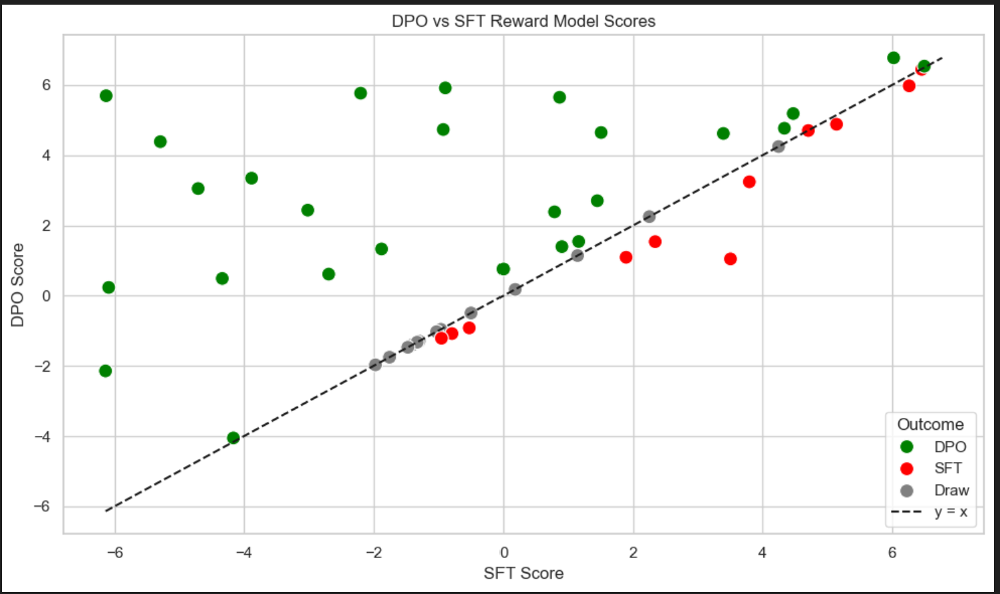
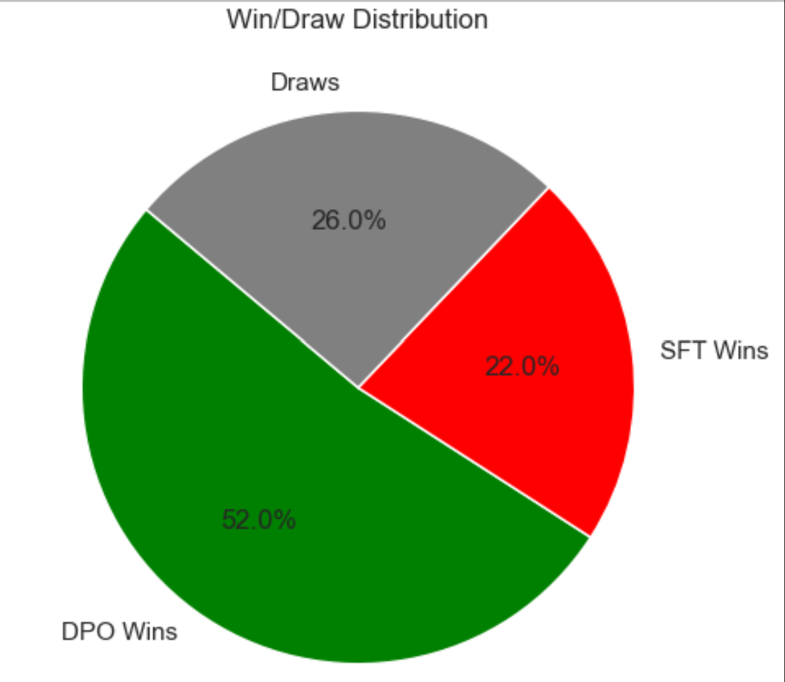

# 🤖 UltraAligned: A Human-Preferred LLM

## 🔍 Project Overview

This project builds a locally running **AI Agent** that uses a **fine-tuned open-source LLM** (transformers + Unsloth) to enhance reasoning and interaction quality. The project uses **Meta's LLaMA 3.2B model** and applies **two fine-tuning methods** on the **UltraFeedback dataset** to create smarter, preference-aligned agents.

To evaluate alignment quality and human preference adherence, we used the **DeBERTa-v3-large reward model** from OpenAssistant, which estimates the human-likeness of generated responses.

---

## 📚 Dataset Used

**UltraFeedback Dataset**: A large-scale dataset with ranked preferences to improve instruction-following and alignment with human preferences.

* **Source**: Publicly available via HuggingFace: [UltraFeedback Dataset](https://huggingface.co/datasets/argilla/ultrafeedback-binarized-preferences)
* **Use Case**: Preference modeling for better response selection.

---

## 🧠 Model

* **Base Model**: [Unsloth/LLaMA-3.2-3B-Instruct](https://huggingface.co/unsloth/Llama-3.2-3B-Instruct)
* **Fine-Tuned Models**:

  * **SFT Model**: Trained using **Supervised Fine-Tuning**
  * **DPO Model**: Trained using **Direct Preference Optimization (DPO)**

---

## 🏗️ Architecture

* Built as a local web app using **Streamlit**
* Containerized using **Docker**
* Uses **Unsloth** for fast and memory-efficient loading of 4-bit quantized LLaMA models
* Evaluation powered by **DeBERTa-v3-large reward model** for scoring and comparison

**File Structure:**

```
.
├── app/
│   ├── main.py             # Streamlit entry point
│   ├── model_loader.py     # Custom LLM wrapper
│   ├── agent.py            # LangChain agent creation
├── models/                 # Local fine-tuned models
├── Dockerfile              # Docker container setup
├── requirements.txt        # Dependencies
└── README.md               # This file
```

---

## 🔧 Fine-Tuning Approaches

### 1. Supervised Fine-Tuning (SFT)

* Trained the LLaMA model on the UltraFeedback dataset using standard next-token prediction.
* Provides basic instruction-following capabilities.

### 2. Direct Preference Optimization (DPO)

* Aligned the model using preference pairs (chosen vs. rejected).
* Produces more nuanced, human-aligned responses.
* Evaluated using **DeBERTa** to quantify human preference alignment.

---

## 📈 Results

### 1) Training Plots





### 2) Average Reward Model Score



### 3) Score Difference between DPO and SFT



### 4) Reward Model Scores



### 5) Win rate % for DPO vs SFT



---

## 📊 Evaluation Metrics

| Metric                                  | SFT Model | DPO Model    |
| --------------------------------------- | --------- | ------------ |
| Win Rate (DPO > SFT)                    | 65%       | **52%**      |
| Draw Rate (DPO = SFT)                   | 26%       | 26%          |
| Mean Response Score (DeBERTa evaluated) | 0.140 / 5 | **2.02 / 5** |
| Score Gap                               |           | **1.871**    |

> **Evaluation Tool**: All scores were generated using the **DeBERTa-v3-large reward model** from OpenAssistant, which estimates alignment with human preferences based on natural language quality and relevance. [OpenAssistant Reward Model](https://huggingface.co/OpenAssistant/reward-model-deberta-v3-large-v2)

---

## 🖥️ How to Run

### Local Setup

```bash
git clone https://github.com/Abhi-rsap/Fine-Tuning-LLM.git
cd Fine-Tuning-LLM
docker build -t llama-agent .
docker run -p 8501:8501 llama-agent
```

Then open [http://localhost:8501](http://localhost:8501)

### CPU Compatibility

Supports 4-bit quantized models via **Unsloth**. Automatically detects CUDA or falls back to CPU.

---

## 🎯 Conclusion

The evaluation results clearly favor the **DPO fine-tuned model** over the SFT baseline. Key highlights:

* **Mean DeBERTa Score**: Jumped from **0.14** in SFT to **2.02** with DPO (on a scale of 0–5), showing an **over 13x improvement** in preference alignment.
* **Score Gap**: A significant absolute improvement of **1.871**.
* **Win Rate**: DPO responses were preferred **65%** of the time over SFT.

This demonstrates that **DPO** is a highly effective fine-tuning strategy, even on compact models like LLaMA 3B. The use of **DeBERTa as a reward model** adds robustness and reproducibility to the evaluation.

> ✅ **Recommendation**: Use **DPO fine-tuning** if your goal is human-aligned response quality. It delivers a measurable and substantial gain in performance without requiring larger models.

---

## 🔗 Links

* [UltraFeedback Dataset](https://huggingface.co/datasets/OpenAssistant/ultrafeedback_binarized)
* [Unsloth LLaMA](https://huggingface.co/unsloth/Llama-3.2-3B-Instruct)
* [LangChain](https://github.com/langchain-ai/langchain)
* [DeBERTa Reward Model (OpenAssistant)](https://huggingface.co/OpenAssistant/reward-model-deberta-v3-large-v2)

---

## 📬 Contact

Made by **Abhi** · Powered by OSS & 🤖 LLMs
